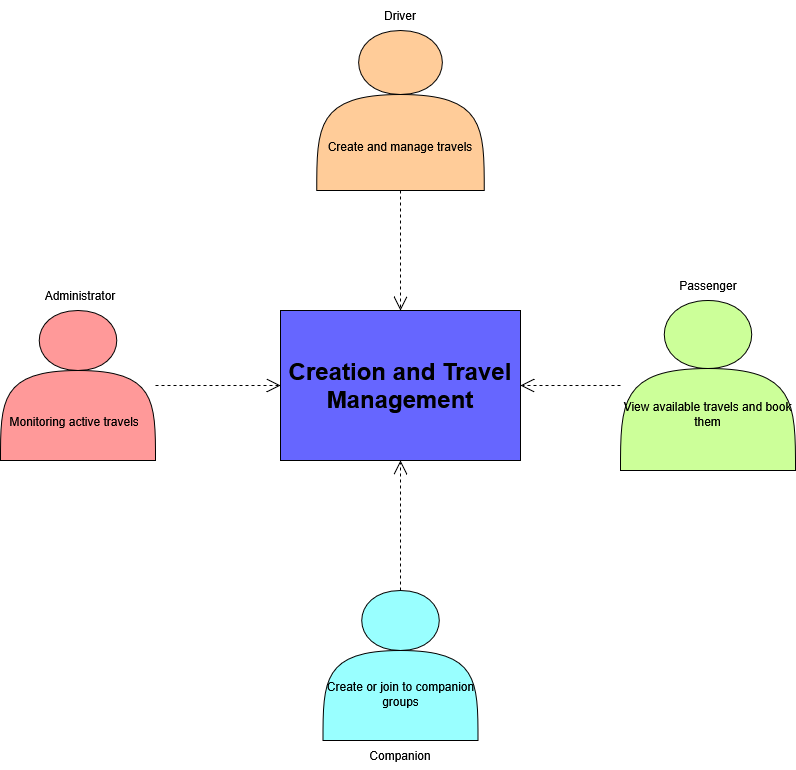
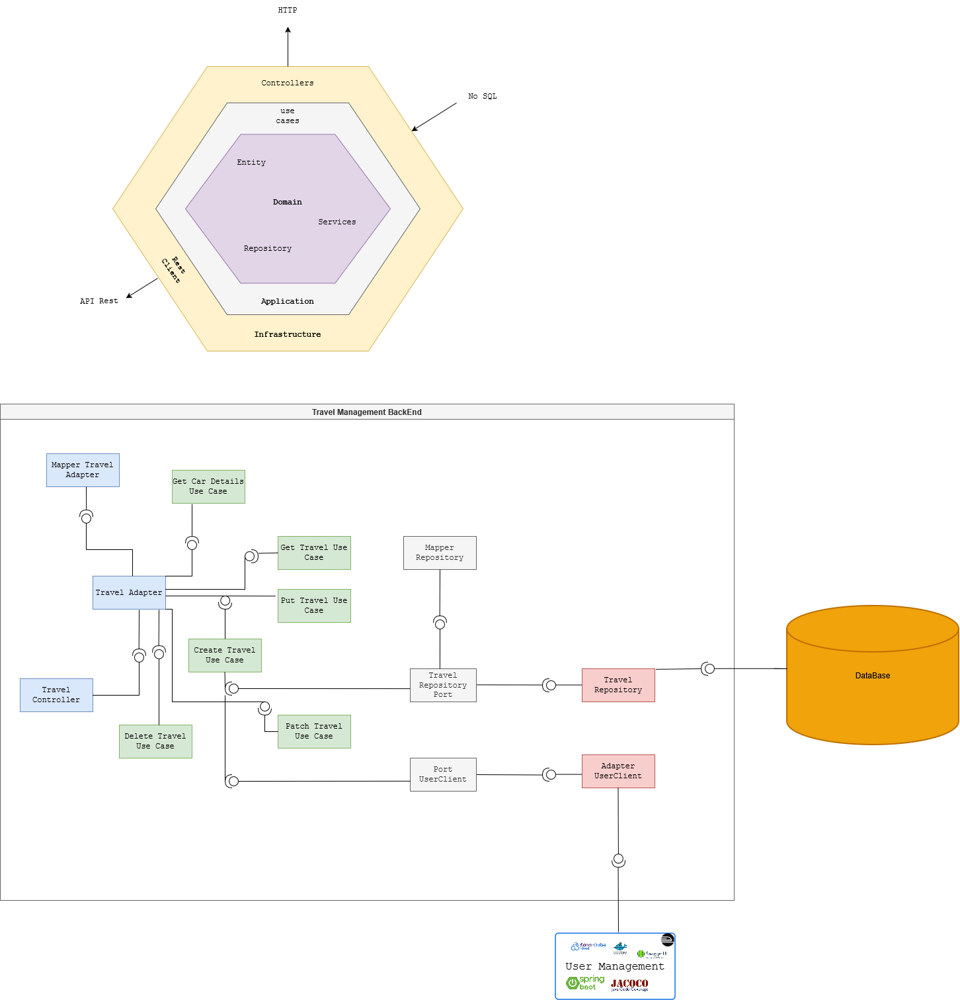
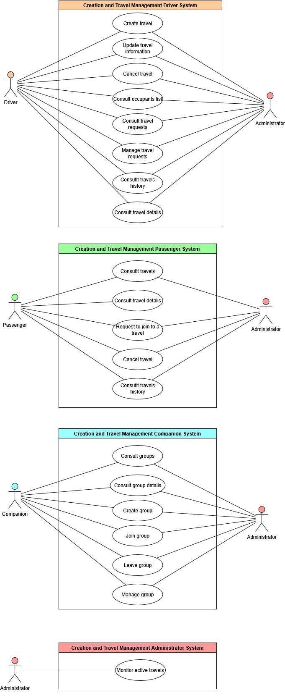
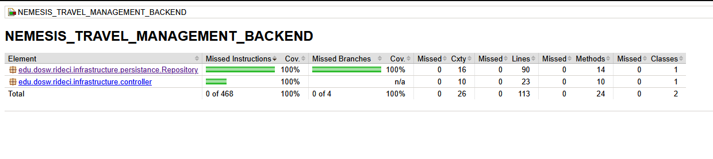

# 📍 Nemesis - Travel Management Backend

This module is designed to manage travels within the RideCi ecosystem: it creates, updates, lists and deletes trips, handles their status (e.g. CREATED, IN_PROGRESS, COMPLETED, CANCELED) and exposes this information to other microservices.

## 👥 Developers

- Santiago Carmona Pineda
- Tulio Riaño Sanchez
- Daniel Patiño Mejia
- Juan Felipe Rangel Rodriguez


## 📑 Content Table

1. [Project Architecture](#-project-architecture)
    - [Hexagonal Structure](#-clean---hexagonal-structure)
2. [API Documentation](#-api-endpoints)
    - [Endpoints](#-api-endpoints)
3. [Input & Output Data](#input-and-output-data)
4. [Microservices Integration](#-connections-with-other-microservices)
5. [Technologies](#technologies)
6. [Branch Strategy](#-branches-strategy--structure)
7. [System Architecture & Design](#-system-architecture--design)
8. [Getting Started](#-getting-started)
9. [Testing](#-testing)

---
## 🏛️ Project Architecture

The Nemesis - Travel Management backend follows a decoupled hexagonal / clean architecture that isolates the business logic from infrastructure and external services by splitting the code into multiple components:

* **🧠 Domain (Core)**: Contains the travel entities, value objects, enums (`Status`, `TravelType`) and the core business rules.

* **🎯 Ports (Interfaces)**: Interfaces that define which operations the domain can perform (use cases exposed as input ports and required external interactions as output ports).

* **🔌 Adapters (Infrastructure)**: Implementations of the ports that connect the domain with technologies such as HTTP controllers, MongoDB persistence and RabbitMQ.

Main benefits of this architecture:

* ✅ **Separation of Concerns:** Clear limits between business logic and infrastructure.
* ✅ **Maintainability:** Easier to modify or replace specific components.
* ✅ **Scalability:** Components can evolve and scale independently.
* ✅ **Testability:** The domain can be tested in isolation without database or web server.

## 📂 Clean - Hexagonal Structure

```
📂 nemesis_travel_management_backend
 ┣ 📂 src/
 ┃ ┣ 📂 main/
 ┃ ┃ ┣ 📂 java/
 ┃ ┃ ┃ ┗ 📂 edu/dosw/rideci/
 ┃ ┃ ┃   ┣ 📄 NemesisTravelManagementBackendApplication.java
 ┃ ┃ ┃   ┣ 📂 domain/
 ┃ ┃ ┃   ┃ ┗ 📂 model/            # 🧠 Domain models (Travel, Location, enums)
 ┃ ┃ ┃   ┣ 📂 application/
 ┃ ┃ ┃   ┃ ┣ 📂 events/           # 📡 Domain events (TravelCreatedEvent, TravelCompletedEvent)
 ┃ ┃ ┃   ┃ ┣ 📂 mapper/           # 🔄 Mappers between domain and infrastructure DTOs
 ┃ ┃ ┃   ┃ ┣ 📂 port/
 ┃ ┃ ┃   ┃ ┃ ┗ 📂 in/             # 🎯 Input ports (use case interfaces)
 ┃ ┃ ┃   ┃ ┗ 📂 service/          # ⚙️ Use case implementations (TravelService)
 ┃ ┃ ┃   ┣ 📂 exceptions/         # ❗ Custom domain/infrastructure exceptions
 ┃ ┃ ┃   ┣ 📂 infrastructure/
 ┃ ┃ ┃   ┃ ┣ 📂 config/           # ⚙️ Spring / Infra configuration (OpenAPI, RabbitMQ)
 ┃ ┃ ┃   ┃ ┣ 📂 controller/
 ┃ ┃ ┃   ┃ ┃ ┣ 📄 TravelController.java   # 🌐 REST controllers
 ┃ ┃ ┃   ┃ ┃ ┗ 📂 dto/                   # 📨 Request / Response DTOs
 ┃ ┃ ┃   ┃ ┃   ┣ 📂 Request/
 ┃ ┃ ┃   ┃ ┃   ┗ 📂 Response/
 ┃ ┃ ┃   ┃ ┗ 📂 persistance/
 ┃ ┃ ┃   ┃   ┣ 📂 Entity/          # 🗄️ MongoDB documents (TravelDocument, LocationDocument)
 ┃ ┃ ┃   ┃   ┣ 📂 Repository/      # 🧰 Spring Data repositories & adapters
 ┃ ┃ ┃   ┃   ┃ ┣ 📄 TravelRepository.java
 ┃ ┃ ┃   ┃   ┃ ┣ 📄 TravelRepostoryAdapter.java
 ┃ ┃ ┃   ┃   ┃ ┗ 📄 RabbitEventPublisher.java
 ┃ ┃ ┗ 📂 resources/
 ┃ ┃   ┗ 📄 application.properties
 ┣ 📂 test/
 ┃ ┣ 📂 java/
 ┃ ┃ ┗ 📂 edu/dosw/rideci/
 ┃ ┃   ┣ 📄 NemesisTravelManagementBackendApplicationTests.java
 ┃ ┃   ┣ 📂 Adapter/
 ┃ ┃   ┃ ┗ 📄 TravelRepositoryAdapterTest.java
 ┃ ┃   ┗ 📂 Controller/
 ┃ ┃     ┗ 📄 TravelControllerTest.java
 ┣ 📂 docs/
 ┃ ┣ diagramaCasosUso.png
 ┃ ┣ diagramaClases.jpg
 ┃ ┣ diagramaComponentes.png
 ┃ ┣ diagramaContexto.png
 ┃ ┣ diagramaDatos.jpg
 ┃ ┗ diagramaDespliegue.png
 ┣ 📄 pom.xml
 ┣ 📄 mvnw / mvnw.cmd
 ┗ 📄 README.md
```

# 📡 API Endpoints

For detailed documentation refer to Swagger UI (running locally at `http://localhost:8080/swagger-ui.html`).

Below is a summary of the main REST endpoints exposed by `TravelController` (base path may vary, e.g. `/api/v1/travels`).

> Note: Adjust the exact URIs if your controller mapping differs.

| Method | URI                        | Description                          | Request Body / Params |
| :----- | :------------------------- | :----------------------------------- | :-------------------- |
| `POST` | `/api/v1/travels`         | Creates a new travel                 | `TravelRequest` (JSON) |
| `GET`  | `/api/v1/travels`         | Retrieves all travels                | — |
| `GET`  | `/api/v1/travels/{id}`    | Retrieves a travel by ID             | `id` (Path Variable) |
| `PUT`  | `/api/v1/travels/{id}`    | Modifies an existing travel          | `id` + `TravelRequest` (JSON) |
| `PATCH`| `/api/v1/travels/{id}/status` | Changes the status of a travel   | `id` + new status (e.g. query/body) |
| `GET`  | `/api/v1/travels/{id}/passengers` | Gets passenger list for a travel | `id` (Path Variable) |
| `DELETE` | `/api/v1/travels/{id}`  | Deletes a travel by ID               | `id` (Path Variable) |


### 📟 HTTP Status Codes
Common status codes returned by the API.

| Code | Status | Description |
| :--- | :--- | :--- |
| `200` | **OK** | Request processed successfully. |
| `201` | **Created** | Travel created successfully. |
| `204` | **No Content** | Travel deleted successfully. |
| `400` | **Bad Request** | Invalid data or missing parameters. |
| `404` | **Not Found** | Travel ID does not exist. |
| `500` | **Internal Server Error** | Unexpected error on server side.|

# Input and Output Data

Data information per functionality (simplified overview):

- **TravelRequest (Input)**
  - `origin` (LocationRequest)
  - `destination` (LocationRequest)
  - `travelType` (e.g. ONE_WAY, ROUND_TRIP)
  - `departureTime`
  - Optional passenger info depending on design

- **TravelResponse (Output)**
  - `id`
  - `origin` / `destination` (LocationResponse)
  - `status` (from `Status` enum)
  - `travelType`
  - `createdAt` / `updatedAt`
  - Additional travel details

- **LocationRequest / LocationResponse**
  - Coordinates or semantic location data used by travels.

You can inspect `LocationRequest`, `LocationResponse`, `TravelRequest` and `TravelResponse` classes under `infrastructure/controller/dto` for full details.


# 🔗 Connections with other Microservices

This module is part of the RideCi ecosystem and typically interacts with other services via REST and message broker (RabbitMQ):

1. **Routes & Tracking Module**: May consume travel events (`TravelCreatedEvent`, `TravelCompletedEvent`) to start or stop geolocation tracking.
2. **Profiles / Passengers Module**: Provides passenger data associated with a travel.
3. **Notifications Module**: Sends alerts related to travel state changes (start, completion, cancellation, etc.).

# Technologies

The following technologies were used to build and deploy this module:

### Backend & Core


### Database


### DevOps & Infrastructure


### CI/CD & Quality Assurance


### Documentation & Testing


### Design


### Comunication & Project Management


---

# 🌿 Branches Strategy & Structure

This module follows a strict branching strategy based on Gitflow to ensure the ordered versioning, code quality and continuous integration.


| **Branch**                | **Purpose**                            | **Receive of**           | **Sent to**        | **Notes**                      |
| ----------------------- | ---------------------------------------- | ----------------------- | ------------------ | ------------------------------ |
| `main`                  | 🏁 Stable code for preproduction or Production | `release/*`, `hotfix/*` | 🚀 Production      | 🔐 Protected with PR y successful CI   |
| `develop`               | 🧪 Main developing branch             | `feature/*`             | `release/*`        | 🔄 Base to continuous deployment |
| `feature/*`             | ✨ New functions or refactors to be implemented       | `develop`               | `develop`          | 🧹 Are deleted after merge to develop      |
| `release/*`             | 📦 Release preparation & final polish.      | `develop`               | `main` y `develop` | 🧪  Includes final QA. No new features added here.     |
| `bugfix/*` o `hotfix/*` | 🛠️ Critical fixes for production         | `main`                  | `main` y `develop` | ⚡ Urgent patches. Highest priority             |


# 🏷️ Naming Conventions

## 🌿 Branch Naming

### ✨ Feature Branches
Used for new features or non-critical improvements.

**Format:**
`feature/[shortDescription]`

**Examples:**
- `feature/authenticationModule`
- `feature/securityService`

**Rules:**
* 🧩 **Case:** strictly *camelCase* (lowercase with hyphens).
* ✍️ **Descriptive:** Short and meaningful description.
---

### 📦 Release Branches
Used for preparing a new production release. Follows [Semantic Versioning](https://semver.org/).

**Format:**
`release/v[major].[minor].[patch]`

**Examples:**
- `release/v1.0.0`
- `release/v1.1.0-beta`

---

### 🚑 Hotfix Branches
Used for urgent fixes in the production environment.

**Format:**
`hotfix/[shortDescription]`

**Examples:**
- `hotfix/fixTokenExpiration`
- `hotfix/securityPatch`

---

## 📝 Commit Message Guidelines

We follow the **[Conventional Commits](https://www.conventionalcommits.org/)** specification.

### 🧱 Standard Format

```text
<type>(<scope>): <short description>
```

# 📐 System Architecture & Design

This section provides a visual representation of the module's architecture ilustrating the base diagrams to show the application structure and components flow.


### 🧩 Context Diagram

---



### 🧩 Specific Components Diagram

---
This diagram visualizes the dependencies between classes for developing the module's logic. It includes the following components:

* Controllers:
    * Travel Management Controller: This controller receives and manages all requests related to travels, including references handled via DTOs.

When applying a hexagonal architecture, before developing the use cases, we need adapter components:

* Adapter:

    * Travel Adapter: Contracts (interfaces) are defined based on the input received from the controllers.

    * Mapper Adapter: This adapter transforms data types from one object to another for use in the respective use cases.

* Use Cases:

    * Create Travel Use Case: Implementation to create new travels.

    * Modify Travel Use Case: Update data for an existing travel.

    * Change State Travel Use Case: Change the travel status during its lifecycle.

    * Get Travel Use Case: Retrieve information about a specific travel.

    * Get All Travel Use Case: Retrieve a list of all travels.

    * Get Passenger List Use Case: Retrieve the passenger list for a travel.

    * Delete Travel Use Case: Delete a travel.

* Ports: The following interfaces were defined as the data we will receive from the outside:

    * Port Notifications

    * Port Profiles

    * Port Travel Information



### 🧩 Use Cases Diagram

---
This diagram presents the main functionalities defined by each actor. This facilitates a better understanding when implementing the module's multiple functions, as well as identifying and separating each actor's roles when using the application.



### 🧩 Class Diagram

---
Based on the Specific Components diagram, we created the class diagram, where we defined an Observer design pattern that will notify all passengers already registered on the trip, allowing them to view information related to the travel.


### 🧩 Data Base Diagram

---

This diagram represents how the data is stored, where we will find the multiple documents, and the data that will be stored in an embedded or referenced manner.


### 🧩 Specific Deploy Diagram

---
This diagram illustrates the cloud deployment architecture and workflow of the travel management module.


# 🚀 Getting Started

This section guides you through setting up the project locally. This project requires **Java 17**. If you have a different version, you can change it or we recommend using **Docker** to ensure compatibility before compiling.

### Clone & open repository

``` bash
git clone https://github.com/RIDECI/NEMESIS_TRAVEL_MANAGEMENT_BACKEND.git
```

``` bash
cd NEMESIS_TRAVEL_MANAGEMENT_BACKEND
```

You can open it in your favorite IDE.

### Dockerize the project

Dockerizing before compiling the project avoids configuration issues and ensures environment consistency.

``` bash
docker compose up -d
```

### Install dependencies & compile project

Download dependencies and compile the source code.

``` bash
mvn clean install
```

``` bash
mvn clean compile
```

### To run the project
Start the Spring Boot server

``` bash
mvn spring-boot:run
```


# 🧪 Testing

Testing is an essential part of the project functionality; this section will show the code coverage and code quality analyzed with tools like JaCoCo and SonarQube.


### 📊 Code Coverage (JaCoCo)

---




### 🔍 Static Analysis (SonarQube)

