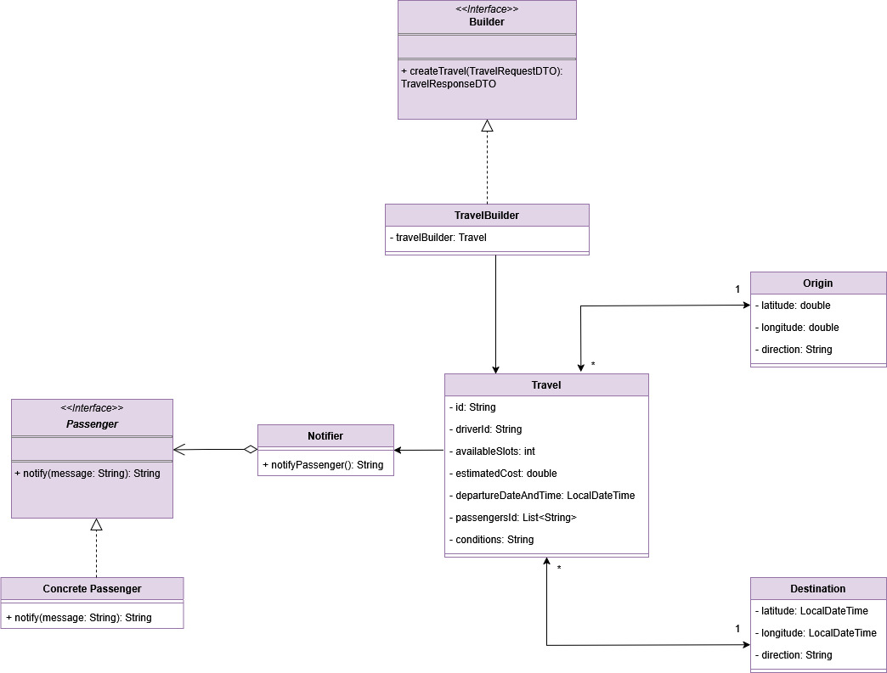
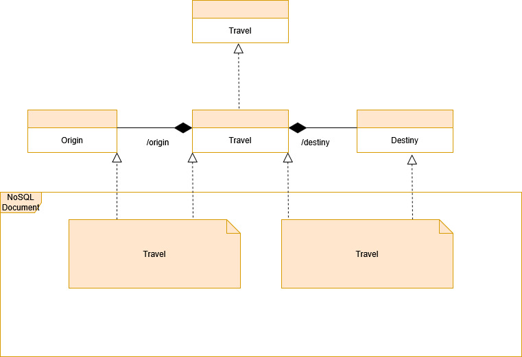
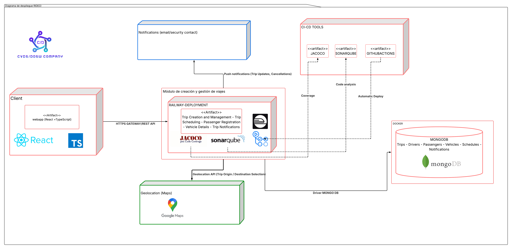

# 🚀 NEMESIS_TRAVEL_MANAGEMENT_BACKEND 
## 👥 Desarrolladores

* 🧑‍💻 Santiago Carmona Pineda
* 🧑‍💻 Tulio Riaño Sánchez
* 🧑‍💻 Daniel Patiño Mejia
* 🧑‍💻 Juan Felipe Rangel Rodríguez

---

## 📑 Tabla de Contenidos

* 📌 [ Estrategia de Versionamiento y Branching](#-estrategia-de-versionamiento-y-branching)

    * 🌿 [ Estrategia de Ramas (Git Flow)](#-estrategia-de-ramas-git-flow)
    * 🏷️ [ Convenciones de Nomenclatura](#-convenciones-de-nomenclatura)
    * 📝 [ Convenciones de Commits](#-convenciones-de-commits)
* 🏗️ [ Arquitectura del Proyecto](#-arquitectura-del-proyecto)

    * 🧱 [ Estructura de Capas](#️-estructura-de-capas)
* 🛠️ [ Tecnologías Utilizadas](#️-tecnologías-utilizadas)
* 🧼 [ Arquitectura Limpia - Organización de Capas](#️-arquitectura-limpia---organización-de-capas)
* 📊 [Diagramas del Módulo](#diagramas-del-módulo)

---

## 🗂️ Estrategia de Versionamiento y Branching

Se implementa una estrategia de versionamiento basada en **GitFlow**, garantizando un flujo de desarrollo **colaborativo, trazable y controlado**.

### ✅ Beneficios:

- 🤝 Permite trabajo paralelo sin conflictos
- 🛡️ Mantiene versiones estables y controladas
- 🚑 Facilita correcciones urgentes (*hotfixes*)
- 📜 Proporciona un historial limpio y entendible

---

## 🌿 Estrategia de Ramas (Git Flow)

| **Rama**                | **Propósito**                            | **Recibe de**           | **Envía a**        | **Notas**                      |
| ----------------------- | ---------------------------------------- | ----------------------- | ------------------ | ------------------------------ |
| `main`                  | 🏁 Código estable para PREPROD o Producción | `release/*`, `hotfix/*` | 🚀 Despliegue      | 🔐 Protegida con PR y CI exitoso  |
| `develop`               | 🧪 Rama principal de desarrollo             | `feature/*`             | `release/*`        | 🔄 Base para integración continua |
| `feature/*`             | ✨ Nuevas funcionalidades o refactors       | `develop`               | `develop`          | 🧹 Se eliminan tras el merge      |
| `release/*`             | 📦 Preparación de versiones estables        | `develop`               | `main` y `develop` | 🧪 Incluye pruebas finales        |
| `bugfix/*` o `hotfix/*` | 🛠️ Corrección de errores críticos           | `main`                  | `main` y `develop` | ⚡ Parches urgentes               |

---

## 🏷️ Convenciones de Nomenclatura

### ✨ Feature Branches

```
feature/[nombre-funcionalidad]
```

**Ejemplos:**

```
- feature/authentication-module
- feature/security-service
```

**Reglas:**

* 🧩 Formato: *kebab-case*
* 🪪 Incluir código Jira
* ✍️ Descripción breve y clara
* 📏 Longitud máxima: 50 caracteres

---

### 📦 Release Branches

```
release/[version]
```

**Ejemplos:**

```
- release/1.0.0
- release/1.1.0-beta
```

---

### 🚑 Hotfix Branches

```
hotfix/[descripcion-breve-del-fix]
```

**Ejemplos:**

```
- hotfix/fix-token-expiration
- hotfix/security-patch
```

---

## 📝 Convenciones de Commits

### 🧱 Formato Estándar

```
[tipo]: [descripción breve de la acción]
```

**Ejemplos:**

```
feat: agregar validación de token JWT
fix: corregir error en autenticación por roles
```

---

### 📂 Tipos de Commit

| **Tipo**   | **Descripción**                      | **Ejemplo**                             |
| ----------- | ------------------------------------ | --------------------------------------- |
| `feat`      | ✨ Nueva funcionalidad               | `feat: implementar autenticación con JWT` |
| `fix`       | 🛠️ Corrección de errores             | `fix: solucionar error en endpoint de login` |
| `docs`      | 📚 Cambios en documentación          | `docs: actualizar README con nuevas rutas` |
| `refactor`  | 🔧 Refactor sin cambio funcional     | `refactor: optimizar servicio de seguridad` |
| `test`      | 🧪 Pruebas unitarias o integración   | `test: agregar tests para AuthService`  |
| `chore`     | 🧹 Mantenimiento o configuración     | `chore: actualizar dependencias de Maven` |

**Reglas:**

* ✅ Un commit = una acción completa
* ✂️ Máximo **72 caracteres** por línea
* 🗣️ Usar modo imperativo (“agregar”, “corregir”, etc.)
* 🔍 Descripción clara de qué y dónde
* 🪜 Commits pequeños y frecuentes

---

## 🏗️ Arquitectura del Proyecto

El backend de **NEMESIS_TRAVEL_MANAGEMENT** sigue una **arquitectura limpia y desacoplada**, priorizando:

* 🧩 Separación de responsabilidades
* 🛠️ Mantenibilidad
* 📈 Escalabilidad
* 🧪 Facilidad de pruebas

---

## 🧱 Estructura de Capas

```
📂 nemesis_travel_management_backend
 ┣ 📂 src/
 ┃ ┣ 📂 main/
 ┃ ┃ ┣ 📂 java/
 ┃ ┃ ┃ ┗ 📂 edu/dosw/rideci/
 ┃ ┃ ┃   ┣ 📄 NemesisTravelManagementBackendApplication.java
 ┃ ┃ ┃   ┣ 📂 domain/
 ┃ ┃ ┃   ┃ ┗ 📂 model/            # 🧠 Modelos del dominio
 ┃ ┃ ┃   ┣ 📂 application/
 ┃ ┃ ┃   ┃ ┣ 📂 ports/
 ┃ ┃ ┃   ┃ ┃ ┣ 📂 input/          # 🎯 Puertos de entrada (casos de uso expuestos)
 ┃ ┃ ┃   ┃ ┃ ┗ 📂 output/         # 🔌 Puertos de salida (gateways externos)
 ┃ ┃ ┃   ┃ ┗ 📂 usecases/         # ⚙️ Implementaciones de casos de uso
 ┃ ┃ ┃   ┣ 📂 infrastructure/
 ┃ ┃ ┃   ┃ ┗ 📂 adapters/
 ┃ ┃ ┃   ┃   ┣ 📂 input/
 ┃ ┃ ┃   ┃   ┃ ┗ 📂 controller/   # 🌐 Adaptadores de entrada (REST controllers)
 ┃ ┃ ┃   ┃   ┗ 📂 output/
 ┃ ┃ ┃   ┃     ┗ 📂 persistence/  # 🗄️ Adaptadores de salida (persistencia)
 ┃ ┃ ┗ 📂 resources/
 ┃ ┃   ┗ 📄 application.properties
 ┣ 📂 test/
 ┃ ┣ 📂 java/
 ┃ ┃ ┗ 📂 edu/dosw/rideci/NEMESIS_TRAVEL_MANAGEMENT_BACKEND/
 ┃ ┃   ┗ 📄 NemesisTravelManagementBackendApplicationTests.java
 ┣ 📂 docs/
 ┃ ┣ diagramaClases.jpg
 ┃ ┣ diagramaDatos.jpg
 ┃ ┗ diagramaDespliegue.png
 ┣ 📄 pom.xml
 ┣ 📄 mvnw / mvnw.cmd
 ┗ 📄 README.md
```

---

## 🛠️ Tecnologías Utilizadas

| **Categoría**              | **Tecnologías**                           |
| -------------------------- | ----------------------------------------- |
| **Backend**                | ☕ Java 17, Spring Boot, Maven             |
| **Base de Datos**          | 🐘 PostgreSQL, 🍃 MongoDB                  |
| **Infraestructura**        | 🐳 Docker, ☸️ Kubernetes (K8s), 🚆 Railway, ▲ Vercel |
| **Seguridad**              | 🔐 JWT, Spring Security                    |
| **Integración Continua**   | 🤖 GitHub Actions, 📊 Jacoco, 🧠 SonarQube  |
| **Documentación y Diseño** | 📖 Swagger UI, 🎨 Figma                    |
| **Comunicación y Gestión** | 💬 Slack, 🧾 Jira                          |
| **Testing**                | 🧪 Postman                                 |

---

## 🧼 Arquitectura Limpia - Organización de Capas

### 🧠 DOMAIN (Dominio)

Representa el **núcleo del negocio**, define **qué hace el sistema, no cómo lo hace**.
Incluye entidades, objetos de valor, enumeraciones, interfaces de repositorio y servicios de negocio.

### 🎯 APPLICATION (Aplicación)

Orquesta la lógica del negocio a través de **casos de uso**, **DTOs**, **mappers** y **excepciones personalizadas**.

### 🧩 INFRASTRUCTURE (Infraestructura)

Implementa los **detalles técnicos**: controladores REST, persistencia, configuración, seguridad y conexión con servicios externos.

---

## 📊 Diagramas del Módulo

### 🧩 Diagrama de Componentes Específico


---

### 🧬 Diagrama de Clases



---

### 🗄️ Diagrama de Bases de Datos



---

### 🚀 Diagrama de Despliegue Específico del Módulo



